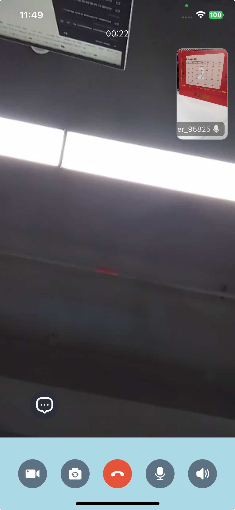

# Customize Bottom Bar

### 1. Update Dependencies

Update the dependencies to the latest version.

```json
"@zegocloud/zego-uikit-rn": "^2.2.6",
"@zegocloud/zego-uikit-prebuilt-call-rn": "^4.2.10",
```

### 2. Adjust the Layout

```javascript
import { ZegoViewPostion } from '@zegocloud/zego-uikit-rn'

layout: {
  config: {
    // Modify the border radius of the small view
    smallViewBorderRadius: 10,
    // Change the position of the small view to the Top Right.
    smallViewPostion: ZegoViewPostion.topRight,
    // Change the size of the small view.
    smallViewSize: { width: 120, height: 180 },
  }
},
```

### 3. Remove the default buttons

```javascript
topMenuBarConfig: {
  buttons: [ ],
},
bottomMenuBarConfig: {
  buttons: [ ],
},
```

### 4. Customize the bottom bar using foreground builder

```javascript
import {
  ZegoLeaveButton,
  ZegoSwitchAudioOutputButton,
  ZegoSwitchCameraButton,
  ZegoToggleCameraButton,
  ZegoToggleMicrophoneButton,
} from '@zegocloud/zego-uikit-rn'

foregroundBuilder: () =>  {
  return (
    <View style={foregroundStyles.container} pointerEvents={'box-none'}>
      <TouchableOpacity
        style={foregroundStyles.chatButton}
        onPress={() => {
          console.log('Chat Button Pressed.');
        }}>
        <Image
          resizeMode='contain' 
          source={require('./resources/white_bottom_button_message.png')} 
          style={{ width: "100%", height: "100%" }} 
        />
      </TouchableOpacity>
      <View style={foregroundStyles.bottomView}>
        <ZegoToggleCameraButton isOn={true} 
          iconCameraOn={require('./resources/white_button_camera_on.png')} 
          iconCameraOff={require('./resources/white_button_camera_off.png')} 
        />
        <ZegoSwitchCameraButton 
          iconFrontFacingCamera={require('./resources/white_button_flip_camera.png')}
          iconBackFacingCamera={require('./resources/white_button_flip_camera.png')} 
        />
        <ZegoLeaveButton 
          iconLeave={require('./resources/white_button_hang_up.png')}
          onPressed={() => {
            props.navigation.navigate('HomeScreen');
        }}
        />
        <ZegoToggleMicrophoneButton isOn={true}
          iconMicOn={require('./resources/white_button_mic_on.png')}
          iconMicOff={require('./resources/white_button_mic_off.png')}
        />
        <ZegoSwitchAudioOutputButton useSpeaker={true}
          iconSpeaker={require('./resources/white_button_speaker_on.png')}
          iconEarpiece={require('./resources/white_button_speaker_off.png')}
          iconBluetooth={require('./resources/white_button_bluetooth_off.png')}
        />
      </View>
    </View>
  );
},
  
const foregroundStyles = StyleSheet.create({
  container: {
    flex: 1,
    alignItems: 'center',
    position: 'absolute',
    height: '100%',
    width: '100%',
  },
  bottomView: {
    flexDirection: 'row',
    justifyContent: 'space-between',
    paddingHorizontal: 30,
    alignItems: 'center',
    position: 'absolute',
    height: 120,
    left: 0,
    right: 0,
    bottom: 0,
    backgroundColor: 'lightblue'
  },
  chatButton: {
    position: 'absolute',
    width: 48,
    height: 48,
    left: 50,
    bottom: 150,
  },
});
```

Please refer to the detailed code in "App.js".


The effect after modification is as follows:


